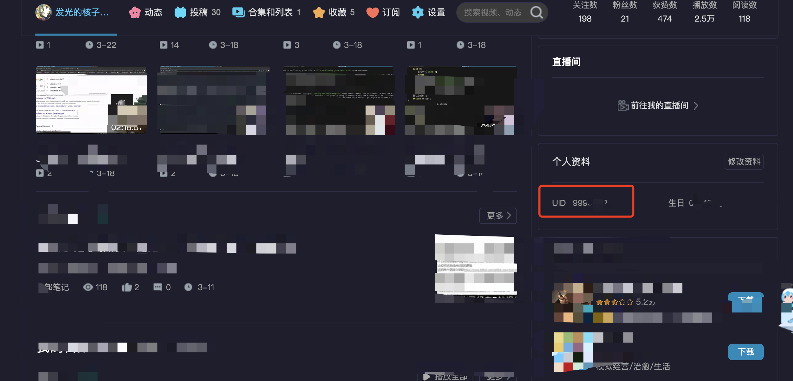
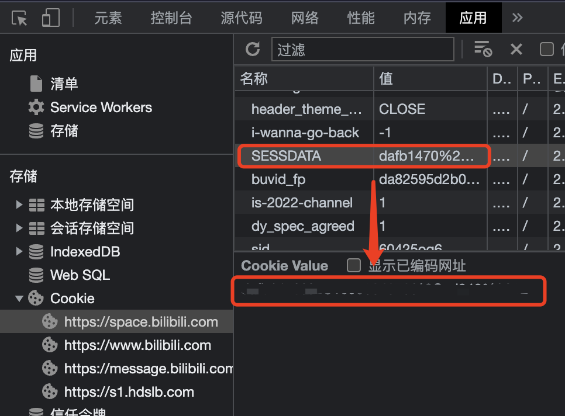
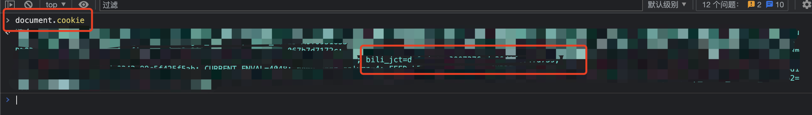

* bilibili favourite unviewable video removal script/plugin
** Usage
- provide uid, SESSDATA, and bili_jct token in [[./main.py][main.py]]
    #+BEGIN_SRC shell
        python main.py -h
                       --write_to_json
                       --remove
    #+END_SRC
** Access the bilibili api, to list all the fav videos
- User uid
    #+BEGIN_SRC shell
    curl -G 'https://api.bilibili.com/x/v3/fav/folder/created/list-all' \
        --data-urlencode 'up_mid=9990462' \
        -b 'SESSDATA=dafb1470%2C1690084979%2Ccd940%2A12'
    #+END_SRC

    #+CAPTION: User Uid
    #+NAME: fig:browser-screenshot-uid
    #+ATTR_HTML: :width 400px
    

- SESSDATA cookie

  #+CAPTION: Cookie needed to access private fav list
  #+NAME: fig:browser-screenshot-cookie
  #+ATTR_HTML: :width 400px
  

- bili_jct CSRF token

  #+CAPTION: Cookie needed to access private fav list
  #+NAME: fig:browser-screenshot-csrf
  #+ATTR_HTML: :width 400px
  

*** [[https://github.com/SocialSisterYi/bilibili-API-collect/blob/master/docs/fav/action.md#:~:text=%E6%9F%A5%E7%9C%8B%E5%93%8D%E5%BA%94%E7%A4%BA%E4%BE%8B%EF%BC%9A-,%E6%B8%85%E7%A9%BA%E6%89%80%E6%9C%89%E5%A4%B1%E6%95%88%E5%86%85%E5%AE%B9,-https%3A//api.bilibili][Link to Github Bilibili api for removing unviewable videos]]
#+BEGIN_SRC shell
    curl 'https://api.bilibili.com/x/v3/fav/resource/clean' \
    --data-urlencode 'media_id=1161340172' \
    --data-urlencode 'csrf=xxx' \
    -b 'SESSDATA=xxx'
#+END_SRC

** Turns out this the removal api doesn't need video id, only folder id is needed
*** Determine whether the video is viewable, if not, remove it
[[https://github.com/SocialSisterYi/bilibili-API-collect/blob/master/docs/fav/action.md#:~:text=%E6%9F%A5%E7%9C%8B%E5%93%8D%E5%BA%94%E7%A4%BA%E4%BE%8B%EF%BC%9A-,%E6%89%B9%E9%87%8F%E5%88%A0%E9%99%A4%E5%86%85%E5%AE%B9,-https%3A//api.bilibili][Link to Github Bilibili api for getting all the videos in all fodlers]]
#+BEGIN_SRC shell
    curl -G 'https://api.bilibili.com/x/v3/fav/resource/list' \
    --data-urlencode 'media_id=71109562' \
    --data-urlencode 'platform=web' \
    --data-urlencode 'pn=1' \
    --data-urlencode 'ps=5' \
    -b 'SESSDATA=dafb1470%2C1690084979%2Ccd940%2A12'
#+END_SRC

** TODO:
*** TODO If can't find csrf token (It's not hard though)
run the ts script to automatically add them
*** TODO Maybe make a plugin with is
